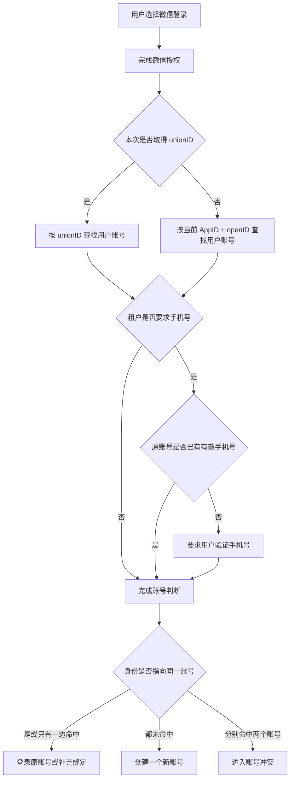

# 登录账号重构需求说明

- 版本：V1.0
- 状态：待评审
- 适用端：APP、微信小程序、租户 SaaS 后台
- 阅读对象：研发、测试、产品
- 编写日期：2026-09-24
- 配套原型：`index.html`

## 1. 本期范围

### 1.1 本期处理

1. APP 手机号登录。
2. APP 微信授权登录。
3. 微信小程序授权登录。
4. 租户控制“微信登录是否强制绑定手机号”。
5. 使用 unionID、`AppID + openID`、已验证手机号判断用户应进入哪个账号。
6. 已有账号补绑微信、补绑手机号。
7. 两个已有账号发生冲突时停止自动处理。
8. 重复授权、拒绝授权、网络失败、身份信息缺失等异常处理。
9. 同一平台用户在不同租户下的数据隔离。

### 1.2 本期不处理

1. 不实现两个有业务数据账号的自动合并。
2. 不处理订单、退款、余额、积分、优惠券、会员、课程权益等数据的实际迁移。
3. 不提供客服合并账号后台。
4. 不支持一个用户账号同时绑定多个主手机号。
5. 不支持一个用户账号同时绑定多个主 unionID。
6. 不处理真实微信接口、密钥和发布配置。

## 2. 名词与判断范围

| 名称 | 本文含义 | 使用范围 |
| --- | --- | --- |
| 用户账号 | 承载订单、会员、收藏、余额和权益的业务账号 | 所有登录方式最终都要进入一个用户账号 |
| unionID | 同一微信开放平台账号下，用于跨 AppID 识别同一微信用户的身份标识 | APP 与小程序跨入口识别 |
| openID | 微信用户在某一个 AppID 下的身份标识 | 只能在当前 AppID 内识别用户 |
| AppID + openID | openID 的完整判断口径 | 判断同一个微信入口内的历史账号 |
| 已验证手机号 | 已通过验证码或微信手机号授权验证的手机号 | 手机号登录、账号补绑和辅助身份判断 |
| 租户 | SaaS 中相互隔离的客户空间 | 订单、角色、会员和权益必须按租户隔离 |
| 项目 | 本文暂按“一个微信 AppID”理解 | `[待确认]` 公司内部“项目”是否还有其他定义 |

### 2.1 unionID 的使用规则

1. 当 APP 与小程序绑定在同一个微信开放平台账号下，并且本次能取得 unionID 时，跨入口识别优先使用 unionID。
2. 当 unionID 能匹配到已有账号时，系统应继续使用该账号。
3. 当 unionID 匹配不到账号时，系统再判断当前 `AppID + openID` 和已验证手机号是否已有归属。
4. 当同一个 unionID 已属于账号 A 时，不能因为本次手机号不同再创建一个新的微信账号。
5. 当 unionID 指向账号 A、手机号指向账号 B 时，系统进入账号冲突，不自动合并。

### 2.2 openID 的使用规则

1. openID 必须与 AppID 一起判断，不能单独比较 openID。
2. 当用户在同一个 AppID 内再次登录时，可以使用 `AppID + openID` 查找该入口下的历史账号。
3. APP 与小程序属于不同 AppID 时，不能直接比较两边 openID 是否相同。
4. 当本次取不到 unionID 时，只能使用当前 `AppID + openID` 判断当前入口内是否为老用户。
5. 当不同 AppID 之间没有 unionID、也没有相同的已验证手机号时，系统不能认定为同一个用户。

## 3. 总体判断顺序

### 3.1 微信登录总体流程

### 3.2 统一账号判断表

| unionID / 当前微信身份归属 | 已验证手机号归属 | 处理结果 | 禁止处理 |
| --- | --- | --- | --- |
| 均未命中 | 均未命中 | 创建一个新账号，并绑定本次已验证身份 | 分别创建两个账号 |
| 命中账号 A | 未命中 | 登录账号 A；需要手机号时将新手机号绑定到 A | 因手机号是新的而再建账号 |
| 未命中 | 命中账号 A | 登录账号 A；将未被占用的微信身份绑定到 A | 新建微信账号 |
| 命中账号 A | 命中账号 A | 直接登录账号 A | 重复建号、重复发权益 |
| 命中账号 A | 命中账号 B | 进入账号冲突 | 自动合并、覆盖绑定、创建第三个账号 |

## 4. 租户开关规则

### 4.1 配置项

- 配置名称：微信登录是否强制绑定手机号
- 配置位置：租户 SaaS 后台 `[具体页面待确认]`
- 默认值：`[待确认，建议默认关闭]`
- 影响范围：APP 微信登录、微信小程序登录
- 不影响范围：手机号登录

### 4.2 开关关闭

**触发条件**

用户选择 APP 微信登录或微信小程序登录，当前租户开关为关闭。

**系统判断顺序**

1. 先判断是否取得 unionID。
2. 有 unionID 时按 unionID 查找账号。
3. 无 unionID 时按当前 `AppID + openID` 查找账号。

**匹配到账号时**

1. 登录匹配到的原账号。
2. 当前 `AppID + openID` 未记录且未被其他账号占用时，补充到原账号。
3. 不要求用户额外授权手机号。

**匹配不到账号时**

1. 创建一个微信身份账号。
2. 保存本次可取得的 unionID 和当前 `AppID + openID`。
3. 用户状态进入“已登录、未绑定手机号”。

**最终结果**

用户完成微信授权后即可进入系统。

### 4.3 开关开启

**触发条件**

用户选择 APP 微信登录或微信小程序登录，当前租户开关为开启。

**系统判断顺序**

1. 先使用 unionID 或当前 `AppID + openID` 查找原账号。
2. 再判断原账号是否已经有有效手机号。
3. 原账号没有手机号时，要求用户完成手机号验证。

**原账号已有手机号时**

1. 不重复要求手机号授权。
2. 直接登录原账号。

**原账号没有手机号，用户完成手机号验证时**

1. 判断该手机号是否已有账号归属。
2. 手机号未命中账号时，将手机号绑定到当前微信账号。
3. 手机号命中当前微信账号时，直接登录。
4. 手机号命中其他账号时，进入账号冲突。

**用户拒绝或取消手机号验证时**

1. 不进入正式登录态。
2. 不创建新的业务账号。
3. 不写入手机号绑定关系。
4. 页面停留在登录流程，并提示“需要绑定手机号后才能继续”。

**最终结果**

只有完成账号归属判断并满足手机号要求后，用户才能进入系统。

### 4.4 开关发生变化

1. 开关从关闭改为开启后，只影响用户下一次微信登录。
2. 已有手机号的用户不重复授权手机号。
3. 没有手机号的存量微信用户，下次微信登录时要求补充手机号。
4. 开关从开启改为关闭后，不删除用户已经绑定的手机号。
5. 开关变化不修改历史订单、会员、收藏和权益归属。

## 5. 场景一：APP 微信授权登录

### 5.1 触发条件

用户在 APP 登录页选择“微信登录”。

### 5.2 系统判断顺序

1. 判断微信授权是否成功。
2. 判断本次是否取得 unionID。
3. 有 unionID 时，先按 unionID 查找账号。
4. 无 unionID 时，按 APP 的 `AppID + openID` 查找账号。
5. 根据租户开关判断是否需要手机号。
6. 最后判断微信身份和手机号是否指向同一个账号。

### 5.3 匹配到已有账号

1. unionID 命中账号时，登录该账号。
2. `AppID + openID` 尚未记录且未被其他账号占用时，补充到该账号。
3. 租户要求手机号且账号已有手机号时，不重复要求授权。
4. 登录成功后，加载当前租户下的用户资料和业务数据。

### 5.4 匹配不到已有账号

1. 开关关闭时，创建微信身份账号并登录。
2. 开关开启时，先要求手机号验证。
3. 手机号未命中账号时，创建一个新账号并绑定微信身份和手机号。
4. 手机号命中已有账号时，将未被占用的微信身份绑定到该手机号账号。

### 5.5 授权失败或取消

1. 微信授权失败时，不创建账号、不写入身份关系。
2. 用户取消时，返回登录页，可继续选择手机号登录。
3. 已经通过手机号登录的用户在绑定微信时取消，不退出当前手机号账号。

### 5.6 最终结果

用户登录已有账号、创建一个新账号，或进入账号冲突；不能出现同一次登录创建多个账号。

## 6. 场景二：微信小程序登录

### 6.1 触发条件

用户首次进入小程序，或小程序登录状态失效后重新进入。

### 6.2 系统判断顺序

1. 判断小程序登录凭证是否有效。
2. 判断是否取得 unionID。
3. 有 unionID 时按 unionID 查找跨入口账号。
4. 无 unionID 时只按小程序的 `AppID + openID` 查找当前小程序账号。
5. 根据租户开关判断是否需要手机号。

### 6.3 unionID 匹配到 APP 已有账号

1. 使用 APP 已有账号作为最终用户账号。
2. 将小程序 `AppID + openID` 补充到该账号。
3. 加载当前租户下的数据，不跨租户带入订单、角色和会员权益。

### 6.4 unionID 匹配不到账号

1. 继续判断当前小程序 `AppID + openID` 是否有历史账号。
2. openID 命中账号时，继续使用该账号。
3. openID 未命中时，根据手机号开关决定直接创建微信账号，或先验证手机号再决定。

### 6.5 无 unionID

1. 只能识别当前小程序 AppID 内的历史用户。
2. 不得将小程序 openID 与 APP openID 直接比较。
3. 如果用户验证的手机号命中 APP 已有账号，可将当前小程序身份绑定到该账号。
4. 如果没有相同的已验证手机号，则不能确认与 APP 用户是同一个人。

### 6.6 最终结果

用户进入原账号、创建小程序微信账号，或因身份冲突停止登录。

## 7. 场景三：APP 手机号登录

### 7.1 触发条件

用户在 APP 登录页输入手机号并完成验证码验证。

### 7.2 系统判断顺序

1. 判断手机号是否验证成功。
2. 按已验证手机号查找账号。

### 7.3 手机号匹配到已有账号

1. 登录该手机号账号。
2. 加载当前租户下的用户资料和业务数据。
3. 不要求用户同时完成微信授权。

### 7.4 手机号匹配不到账号

1. 创建一个手机号账号。
2. 用户状态进入“已登录、未绑定微信”。
3. 后续需要跨入口同步时，再引导用户绑定微信。

### 7.5 验证失败

1. 验证码错误、过期或手机号验证失败时，不创建账号。
2. 页面提示明确失败原因，允许重新获取验证码。

### 7.6 最终结果

用户登录原手机号账号或创建一个手机号账号；微信授权不是手机号登录的前置条件。

## 8. 场景四：手机号用户后续绑定微信

### 8.1 允许触发的场景

1. 用户在账号中心主动选择“绑定微信”。
2. 用户主动开启跨 APP、小程序同步。
3. 用户准备从 APP 跳转小程序，并已被明确告知绑定用途。
4. 某项业务确实必须识别微信身份，且该业务单独说明了原因。

### 8.2 不应触发的场景

1. 观看直播。
2. 收藏。
3. 普通分享。
4. 进入“我的”。
5. 立即购买。
6. 通讯录授权。通讯录应使用手机系统权限，不属于微信授权。

### 8.3 系统判断顺序

1. 保留当前手机号登录状态和用户原操作。
2. 完成微信授权。
3. 有 unionID 时按 unionID 查找归属。
4. 无 unionID 时按当前 `AppID + openID` 查找归属。
5. 判断微信身份是否已属于其他账号。

### 8.4 微信身份未被占用

1. 将微信身份绑定到当前手机号账号。
2. 绑定成功后回到用户原操作。
3. 不创建新账号。

### 8.5 微信身份已属于当前账号

1. 视为重复绑定。
2. 返回绑定成功。
3. 不重复写入、不重复发放权益。

### 8.6 微信身份已属于其他账号

1. 停止绑定。
2. 保留当前手机号登录状态。
3. 进入账号冲突提示，不静默切换到另一个账号。

### 8.7 用户拒绝或授权失败

1. 保留当前手机号登录状态。
2. 保留已完成的收藏、下单等业务结果。
3. 不创建微信账号、不写入半绑定关系。
4. 返回用户发起绑定前的页面。

### 8.8 最终结果

绑定成功、重复绑定视为成功、用户取消，或进入账号冲突。

## 9. 场景五：同一 unionID，手机号不同

### 9.1 触发条件

unionID 已属于账号 A，但用户本次验证的手机号与账号 A 原手机号不同。

### 9.2 系统先判断

1. 新手机号是否已属于其他账号。
2. 当前操作是否为用户主动换号。

### 9.3 新手机号未被占用

1. 继续使用 unionID 对应的账号 A。
2. 不创建第二个微信账号。
3. 进入手机号换号确认流程 `[换号验证方式待确认]`。
4. 换号未完成前，不覆盖原手机号。

### 9.4 新手机号已属于账号 B

1. 停止自动绑定或换号。
2. 进入账号冲突。
3. 保持账号 A、账号 B 原有数据不变。

### 9.5 最终结果

用户继续使用账号 A，完成受控换号，或进入账号冲突；不能因手机号不同创建新的 unionID 用户。

## 10. 场景六：同一手机号，unionID 不同

### 10.1 触发条件

手机号已属于账号 A，本次微信授权取得的 unionID 与账号 A 已绑定 unionID 不同。

### 10.2 系统先判断

1. 账号 A 是否已经绑定其他 unionID。
2. 新 unionID 是否已有账号归属。

### 10.3 账号 A 尚未绑定 unionID，且新 unionID 未被占用

1. 将新 unionID 绑定到账号 A。
2. 完成登录或绑定。

### 10.4 账号 A 已绑定其他 unionID

1. 不覆盖原 unionID。
2. 不允许一个账号在 V1 中绑定多个主 unionID。
3. 进入账号冲突或人工处理。

### 10.5 新 unionID 已属于账号 B

1. 进入账号冲突。
2. 不因手机号相同自动合并账号 A 和账号 B。

### 10.6 最终结果

新 unionID 安全补绑到账号 A，或进入账号冲突。

## 11. 场景七：unionID 与 openID 的匹配结果不一致

### 11.1 触发条件

微信登录时，同时取得 unionID 和当前 `AppID + openID`，但两种身份的历史匹配结果不一致；或本次没有 unionID，openID 与手机号分别命中不同账号。

### 11.2 unionID 命中账号 A，当前 `AppID + openID` 未命中

1. 使用账号 A。
2. 当前 `AppID + openID` 未被占用时，补充到账号 A。
3. 最终登录账号 A。

### 11.3 unionID 未命中，当前 `AppID + openID` 命中账号 A

1. 先检查账号 A 是否已有其他 unionID。
2. 账号 A 没有 unionID，且本次 unionID 未被占用时，将 unionID 补充到账号 A。
3. 账号 A 已有不同 unionID 时，进入账号冲突。

### 11.4 unionID 命中账号 A，当前 `AppID + openID` 命中账号 B

1. 判定为历史身份关系冲突。
2. 不自动选择账号 A 或账号 B。
3. 停止登录或绑定，进入人工核查。

### 11.5 无 unionID，当前 `AppID + openID` 命中账号 A，手机号命中账号 B

1. 判定为当前入口微信账号与手机号账号冲突。
2. 不把 openID 从账号 A 转移到账号 B。
3. 不使用手机号覆盖账号 A。
4. 进入账号冲突处理。

### 11.6 unionID、openID 均未命中

1. 根据手机号开关决定是否继续验证手机号。
2. 没有其他账号命中时，只创建一个新账号。

### 11.7 最终结果

身份关系一致时补充缺失绑定并登录；身份关系不一致时进入账号冲突，不自动选择或覆盖任一账号。

## 12. 场景八：不同项目、不同入口

### 12.1 触发条件

用户从新的 APP、小程序 AppID 或新的 SaaS 租户进入系统，需要判断是否继续使用历史账号。

### 12.2 同一开放平台下的不同 AppID

1. 能取得 unionID 时，使用 unionID 判断是否为同一平台用户。
2. unionID 相同且没有其他身份冲突时，进入同一个平台用户账号。
3. 为当前 AppID 补充对应 openID。
4. 不直接比较两个 AppID 的 openID。

### 12.3 不同开放平台或无法取得 unionID

1. `AppID + openID` 只能识别各自入口内的用户。
2. 用户完成手机号验证，且手机号命中同一账号时，可以使用手机号账号承接当前入口身份。
3. 没有相同的已验证手机号时，不能认定为同一个用户。

### 12.4 同一用户进入不同租户

1. 可以识别为同一个平台用户账号。
2. 每个租户分别建立租户内用户关系。
3. 只加载当前租户的订单、角色、会员、通讯录和权益。
4. 不允许跨租户合并或展示业务数据。

### 12.5 最终结果

能通过 unionID 或已验证手机号确认身份时，继续使用原平台账号；证据不足时保持入口账号独立；无论是否为同一平台账号，租户业务数据始终隔离。

## 13. 场景九：unionID 首次缺失，后续又取得

### 13.1 触发条件

用户第一次登录时只有 `AppID + openID`，后续登录取得 unionID。

### 13.2 系统判断顺序

1. 先按当前 `AppID + openID` 找到原账号 A。
2. 再判断本次 unionID 是否已有账号归属。

### 13.3 unionID 未被占用

1. 将 unionID 补充到账号 A。
2. 后续跨入口登录可使用 unionID 找到账号 A。

### 13.4 unionID 已属于账号 B

1. 停止补绑。
2. 进入账号冲突。
3. 不自动把账号 A 合并到账号 B。

### 13.5 最终结果

账号 A 获得跨入口识别能力，或进入账号冲突。

## 14. 三个双手机号重点案例

### 14.1 CASE 1：APP 先使用手机号 139 登录，尚未绑定微信

**已有状态**

APP 已存在账号 A，手机号为 139，账号 A 没有 unionID。

**用户操作**

用户从微信小程序发起微信登录；如果租户开关开启，用户同时授权手机号。

**系统判断顺序**

1. 先判断小程序取得的 unionID 是否已有账号归属。
2. unionID 未被占用时，再判断小程序取得的已验证手机号是否已有账号归属。

**小程序手机号也是 139**

1. 手机号命中账号 A。
2. unionID 未被占用时，将 unionID 和小程序 `AppID + openID` 绑定到账号 A。
3. 最终登录账号 A，不创建新账号。

**小程序手机号不是 139，且新手机号未被占用**

1. 当前小程序登录无法证明与账号 A 是同一个人。
2. 创建一个新的小程序用户账号 B。
3. 将本次 unionID、`AppID + openID` 和新手机号绑定到账号 B。
4. 账号 A 与账号 B 保持独立。

**小程序手机号命中其他账号 B**

1. unionID 未被占用时，将微信身份绑定到账号 B。
2. 登录账号 B。
3. 不与手机号 139 的账号 A 合并。

**unionID 已属于其他账号 C**

1. 如果本次手机号也属于账号 C，登录账号 C。
2. 如果本次手机号属于账号 A 或账号 B，进入账号冲突。
3. 不创建第三个账号。

**反向顺序**

先小程序登录、后 APP 手机号登录时，使用同一组身份信息应得到相同结果。

### 14.2 CASE 2：APP 微信账号已绑定手机号 138

**已有状态**

账号 A 已绑定 unionID-1、APP `AppID + openID` 和手机号 138。

**用户操作**

用户从微信小程序登录，并取得 unionID 和手机号。

**小程序 unionID 仍为 unionID-1**

1. 系统确认是账号 A 的同一微信身份。
2. 将小程序 `AppID + openID` 补充到账号 A。
3. 小程序手机号也是 138 时，直接登录账号 A。
4. 小程序手机号是新号码且未被占用时，登录账号 A，并进入换号确认。
5. 小程序手机号已属于账号 B 时，进入账号冲突。
6. 不能因为手机号不等于 138 而创建第二个微信用户。

**小程序 unionID 不是 unionID-1**

1. 如果手机号 138 命中账号 A，但账号 A 已有 unionID-1，不覆盖原 unionID。
2. 新 unionID 未被占用时，也不能直接给账号 A 增加第二个主 unionID。
3. 进入账号冲突或人工核查。

**反向顺序**

先小程序登录、后 APP 微信登录时，只要 unionID 相同，最终仍应使用账号 A；手机号变化单独处理。

### 14.3 CASE 3：小程序先微信登录，租户开关关闭，未绑定手机号

**已有状态**

小程序已创建微信账号 A，记录 unionID-1 和小程序 `AppID + openID`，没有手机号。

**用户操作**

用户后来在 APP 使用手机号登录形成账号 B，并在 APP 中发起微信绑定。

**APP 取得的 unionID 为 unionID-1**

1. 系统确认 APP 微信身份与小程序账号 A 是同一微信身份。
2. 如果手机号账号 B 已经存在，说明两个业务账号已经分别产生。
3. 系统进入账号冲突或账号归一流程，不直接把 B 覆盖到 A，也不直接把 A 覆盖到 B。
4. 本期不执行订单、会员和权益迁移。

**APP 取得的 unionID 不是 unionID-1**

1. 系统判定为不同微信身份。
2. 账号 A 与账号 B 保持独立。
3. 不因为用户声称是同一个人而自动合并。

**APP 未取得 unionID**

1. 只能判断 APP 当前 `AppID + openID`。
2. 不能将 APP openID 与小程序 openID 直接比较。
3. 暂时无法确认与小程序账号 A 是否为同一微信用户。
4. 保持账号 A、账号 B 独立，等待后续取得 unionID 或进入额外验证。

**最终结果**

CASE 3 跨 APP、小程序判断使用 unionID，不使用裸 openID；同 unionID 但已形成两个业务账号时，也必须先处理账号冲突。

## 15. 账号冲突处理

### 15.1 冲突成立条件

满足以下任一情况时进入账号冲突：

1. unionID 命中账号 A，手机号命中账号 B。
2. unionID 命中账号 A，当前 `AppID + openID` 命中账号 B。
3. 当前 `AppID + openID` 命中账号 A，已验证手机号命中账号 B。
4. 当前账号已有 unionID，本次取得另一个 unionID。
5. 待绑定微信身份已属于其他账号。

### 15.2 系统处理

1. 不覆盖任何已有绑定。
2. 不静默切换用户当前账号。
3. 不创建第三个账号。
4. 不自动迁移订单、余额、积分、券和会员。
5. 保留用户进入冲突前的页面和当前可用登录状态。
6. 记录冲突双方、触发入口和处理状态，供后续核查。

### 15.3 用户后续流转

1. 提示用户“当前微信和手机号分别属于不同账号，需要进一步验证”。
2. 用户分别验证两个账号的控制权。
3. 任一账号验证失败时，不执行合并。
4. 两边验证成功后，进入人工或受控合并流程 `[本期不实现]`。

### 15.4 最终结果

冲突被拦截并保留记录，原账号数据不变。

## 16. 用户状态流转

| 当前状态 | 触发条件 | 系统处理 | 下一状态 |
| --- | --- | --- | --- |
| 未登录 | 手机号验证成功，手机号未命中账号 | 创建手机号账号 | 已登录、未绑定微信 |
| 未登录 | 微信授权成功，开关关闭，微信身份未命中 | 创建微信账号 | 已登录、未绑定手机号 |
| 未登录 | 微信授权成功，开关开启，账号无手机号 | 要求验证手机号 | 待补手机号 |
| 待补手机号 | 手机号验证成功且无冲突 | 创建或补绑账号 | 已登录、身份已绑定 |
| 待补手机号 | 用户拒绝手机号 | 不建号、不绑定 | 未登录 |
| 已登录、未绑定微信 | 用户主动绑定微信且无冲突 | 补绑微信身份 | 已登录、身份已绑定 |
| 已登录、未绑定微信 | 微信身份属于其他账号 | 停止绑定 | 已登录、账号冲突待处理 |
| 已登录、未绑定手机号 | 下次登录遇到开关开启 | 要求补充手机号 | 待补手机号 |
| 任意绑定中状态 | 身份分别命中两个账号 | 停止自动处理 | 账号冲突待处理 |

## 17. 异常与边界场景

| 场景 | 系统处理 | 数据要求 | 用户结果 |
| --- | --- | --- | --- |
| 用户拒绝微信授权 | 不创建微信账号，不写入绑定 | 保留原手机号登录和原操作 | 返回原页面或登录页 |
| 用户拒绝强制手机号授权 | 不进入正式登录态 | 不创建半成品账号 | 停留在手机号补充页 |
| 微信授权失败 | 提示授权失败，可重试 | 不写入身份关系 | 未登录或保留原登录态 |
| 手机号验证失败 | 提示具体原因，可重试 | 不创建账号、不绑定 | 保持原状态 |
| unionID 缺失 | 仅使用当前 `AppID + openID` | 不做跨 AppID 判断 | 当前入口可继续，跨入口身份待确认 |
| openID 缺失 | 本次微信登录失败 | 不写入身份关系 | 提示重新授权 |
| unionID 与 openID 命中不同账号 | 进入冲突 | 不覆盖任何关系 | 暂停登录或绑定 |
| 同一 unionID 不同手机号 | 使用 unionID 原账号 | 不直接覆盖原手机号 | 换号确认或冲突 |
| 同一手机号不同 unionID | 判断账号是否已有 unionID | 不覆盖原 unionID | 补绑或冲突 |
| 手机号可能被回收 | 不能仅凭手机号覆盖已有 unionID 归属 | 保留历史身份关系 | 增加验证或人工处理 |
| 连续点击登录/绑定 | 同一次操作只处理一次 | 不重复建号、不重复发权益 | 返回同一结果 |
| 网络超时后重试 | 查询上次处理结果后再决定是否重试 | 不产生重复账号 | 返回成功结果或允许重试 |
| 微信服务异常 | 提示暂时无法使用微信登录 | 不改用户账号状态 | 可改用手机号登录 |
| 账号被停用 | 不允许重新创建同身份新账号 | 保留停用状态 | 提示账号不可用及处理入口 |
| 账号已注销 | 按注销保留期规则处理 `[待确认]` | 不直接复用历史身份 | 提示恢复或重新注册规则 |
| 租户开关被修改 | 下次微信登录使用新配置 | 不改历史绑定和业务数据 | 当前会话不受影响 |
| 跨租户访问 | 只加载当前租户数据 | 数据严格隔离 | 不展示其他租户信息 |

## 18. 重复操作规则

1. 同一个用户重复点击登录，不得创建多个账号。
2. 同一微信身份重复绑定当前账号，返回绑定成功。
3. 同一手机号重复绑定当前账号，返回绑定成功。
4. 同一次授权因网络原因重复提交，最终账号归属必须一致。
5. 重复授权不得重复发放新人券、积分、会员权益或其他注册奖励。
6. 已进入账号冲突的相同请求再次提交，继续返回冲突状态，不重新创建账号。

## 19. 权限规则

| 操作 | 普通用户 | 租户管理员 | 平台运营/客服 |
| --- | --- | --- | --- |
| 手机号登录 | 可以 | 不适用 | 不适用 |
| 微信登录 | 可以 | 不适用 | 不适用 |
| 主动绑定微信 | 可以操作自己的账号 | 不可代用户授权 | 不可代用户授权 |
| 配置是否强制手机号 | 不可 | 可以配置本租户 | 可以查看配置 |
| 查看账号冲突 | 只看自己的提示 | 不可查看其他租户用户 | `[待确认]` 是否开放核查权限 |
| 执行账号合并 | 本期不支持 | 本期不支持 | 本期不支持 |

## 20. 验收用例

| 用例编号 | 前置条件 | 用户操作 | 预期结果 |
| --- | --- | --- | --- |
| TC-01 | 开关关闭；unionID、openID 均为新 | 微信登录 | 创建一个微信账号并登录，不要求手机号 |
| TC-02 | 开关开启；unionID、openID、手机号均为新 | 微信登录并授权手机号 | 创建一个账号，同时绑定微信身份和手机号 |
| TC-03 | 开关开启；unionID 命中已有且账号已有手机号 | 微信登录 | 直接登录，不重复要求手机号 |
| TC-04 | 开关开启；账号无手机号 | 用户拒绝手机号授权 | 不进入正式登录态，不创建半成品账号 |
| TC-05 | unionID 命中 A；手机号未命中 | 微信登录并验证手机号 | 登录 A，并把手机号绑定到 A |
| TC-06 | unionID 未命中；手机号命中 A | 微信登录并验证手机号 | 登录 A，并把微信身份绑定到 A |
| TC-07 | unionID、手机号均命中 A | 微信登录 | 直接登录 A，不重复创建数据 |
| TC-08 | unionID 命中 A；手机号命中 B | 微信登录 | 进入账号冲突，不自动合并或新建账号 |
| TC-09 | unionID 命中 A；新手机号未被占用 | 微信登录 | 使用 A，进入换号确认，不新建微信用户 |
| TC-10 | unionID 命中 A；新手机号命中 B | 微信登录 | 进入账号冲突 |
| TC-11 | 手机号账号 A 尚无 unionID；新 unionID 未被占用 | 绑定微信 | 将 unionID 绑定到 A |
| TC-12 | 手机号账号 A 已有 unionID-1；本次为 unionID-2 | 绑定微信 | 不覆盖，进入冲突或人工处理 |
| TC-13 | 无 unionID；当前 AppID + openID 命中 A | 微信登录 | 登录 A，只确认当前入口身份 |
| TC-14 | APP 与小程序 AppID 不同；仅 openID 文本相同 | 跨入口登录 | 不认为是同一用户，不直接合并 |
| TC-15 | unionID 命中 A；当前 AppID + openID 未记录 | 微信登录 | 登录 A，并补充当前入口 openID |
| TC-16 | unionID 命中 A；当前 AppID + openID 命中 B | 微信登录 | 进入历史身份冲突 |
| TC-17 | openID 原账号 A 后续取得新 unionID，unionID 未被占用 | 再次登录 | 将 unionID 补充到 A |
| TC-18 | openID 原账号 A 后续取得 unionID，但 unionID 已属于 B | 再次登录 | 进入账号冲突 |
| TC-19 | 手机号已有账号 | 手机号登录 | 直接登录原手机号账号，不要求微信授权 |
| TC-20 | 手机号为新 | 手机号登录 | 创建手机号账号，状态为未绑定微信 |
| TC-21 | 用户已手机号登录且未绑微信 | 点击直播、收藏、分享、我的、购买 | 不弹微信授权，继续原操作 |
| TC-22 | 用户已手机号登录 | 在账号中心主动绑定微信，微信未被占用 | 绑定成功并保留当前账号 |
| TC-23 | 用户已手机号登录 | 绑定微信时取消 | 保留当前登录和原页面，不写入绑定 |
| TC-24 | 同 unionID 首次进入新租户 | 微信登录 | 建立当前租户用户关系，不带入其他租户业务数据 |
| TC-25 | 同一开放平台不同 AppID，unionID 相同 | 跨入口登录 | 进入同一平台账号并补充当前 openID |
| TC-26 | 不同 AppID，无 unionID，但验证手机号命中 A | 跨入口登录 | 使用手机号账号 A 承接当前入口身份 |
| TC-27 | 同一次登录连续点击两次 | 微信或手机号登录 | 只产生一个账号和一次登录结果 |
| TC-28 | 微信服务超时 | 微信登录 | 不创建账号，可重试或改用手机号登录 |
| TC-29 | 手机号验证服务失败 | 绑定手机号 | 不写入手机号、不改变原账号状态 |
| TC-30 | 身份命中已停用账号 | 登录 | 不创建新账号，提示账号不可用 |
| TC-31 | 开关由关闭改为开启；存量微信用户无手机号 | 用户下次微信登录 | 要求补充手机号；历史业务数据不变 |

## 21. 待确认问题

1. 租户开关默认开启还是关闭。本文建议默认关闭。
2. “不同项目”是否等同于不同微信 AppID；是否还包含不同租户、不同业务线或私有化项目。
3. APP 与小程序是否全部绑定在同一个微信开放平台账号下。
4. 手机号换号需要哪些验证步骤，是否必须验证原手机号。
5. 账号已注销后的身份保留期和重新注册规则。
6. 账号冲突时，是否需要平台客服核查入口；V1 是否仅提示用户联系客服。
7. 冲突提示文案、客服渠道和处理时效。
8. 手机号登录创建新用户时，是否发放新人权益；若发放，必须与微信注册共用同一防重复口径。
9. 当前线上是否已经存在一个 unionID 对应多个用户、一个手机号对应多个用户的历史脏数据。

## 22. 研发与测试统一口径

1. unionID 用于同一开放平台下的跨 AppID 判断。
2. openID 只用于当前 AppID，判断时必须带 AppID。
3. 手机号必须是本次已验证或历史有效绑定的手机号。
4. 登录顺序不能改变最终账号归属。
5. 只有一边命中账号时，使用原账号并补充未被占用的身份。
6. 两种身份命中同一账号时，直接登录。
7. 两种身份命中不同账号时，必须进入冲突。
8. 不允许自动覆盖已有 unionID、openID 或手机号归属。
9. 不允许同一次授权创建多个账号或重复发放权益。
10. 不允许因为 unionID 相同而跨租户带出业务数据。
