# 登录账号重构需求说明

> 版本：V1.1（精简流程版）  
> 适用范围：APP、微信小程序、租户 SaaS 后台  
> 阅读对象：产品、研发、测试  
> 配套原型：[index.html](index.html)

## 1. 本期范围

本期解决四件事：

1. 使用 unionID 识别同一微信用户。
2. 使用手机号补充账号识别和绑定。
3. 处理 unionID、openID、手机号命中不同账号的冲突。
4. 由租户后台控制“微信登录是否必须绑定手机号”。

本期不做：真实微信接口、历史资产迁移、人工合并后台、多个主手机号、多个主 unionID。

## 2. 统一口径

| 名称 | 业务含义 | 使用范围 |
|---|---|---|
| 用户账号 | 用户在系统内的唯一身份 | 承接订单、会员、课程、收藏等业务数据 |
| unionID | 同一微信开放平台下的微信身份 | APP 与小程序跨入口识别用户时优先使用 |
| AppID + openID | 用户在某一个微信应用内的身份 | 仅用于当前 AppID 内识别，不跨 AppID 比较 |
| 已验证手机号 | 用户通过验证码或微信手机号授权确认的号码 | 辅助识别账号、绑定手机号 |
| 租户 | SaaS 客户的数据空间 | 不同租户的数据和关系互不串用 |

### 2.1 身份判断顺序

1. 能取得 unionID 时，先按 unionID 判断。
2. 取得不到 unionID 时，只能按当前 AppID + openID 判断。
3. 手机号完成验证后，再判断该手机号是否已有账号。
4. unionID 和手机号同时命中时，按下表处理。

| unionID 结果 | 手机号结果 | 处理结果 |
|---|---|---|
| 都未命中 | 都未命中 | 创建一个新账号，同时绑定微信身份和手机号 |
| 命中账号 A | 未命中 | 使用账号 A；手机号未被占用时可绑定 A |
| 未命中 | 命中账号 A | 使用账号 A；微信身份未被占用时可绑定 A |
| 都命中账号 A | 都命中同一账号 | 直接使用账号 A |
| 命中账号 A | 命中账号 B | 进入账号冲突，不自动合并、不覆盖 |

### 2.2 租户开关

后台配置项统一命名为：**微信登录是否强制绑定手机号**。

| 开关状态 | 微信登录处理 | 已有账号已有有效手机号 |
|---|---|---|
| 关闭 | 微信授权完成后即可继续 | 不再要求手机号 |
| 开启 | 账号没有手机号时，必须完成手机号验证 | 不重复要求授权手机号 |

补充规则：

1. 开关只影响微信登录，不影响手机号验证码登录。
2. 开关修改后，仅影响下一次登录或绑定，不删除已有数据。
3. 通讯录权限属于系统权限，不能与微信授权混为一件事。

## 3. 场景流程

### 3.1 APP 微信登录

**触发：** 用户在 APP 登录页选择“微信登录”。

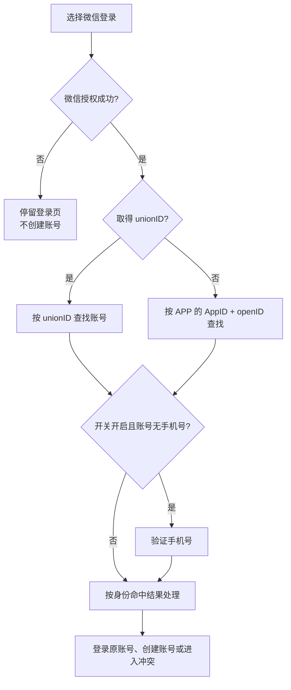

**关键规则：**

1. 已有账号已有有效手机号时，不重复要求手机号授权。
2. 微信授权或手机号验证失败时，不创建半完成账号，也不写入绑定关系。
3. 最终结果按“身份判断表”处理。

### 3.2 微信小程序登录

**触发：** 用户首次进入小程序，或登录状态失效后重新进入。

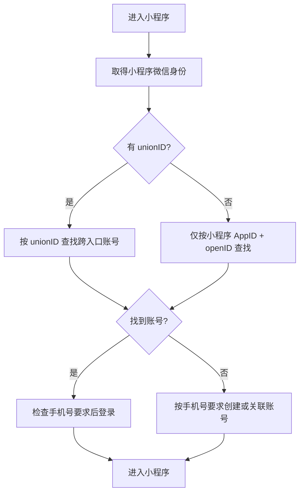

**关键规则：**

1. unionID 命中 APP 已有账号时，使用同一账号，并补充小程序的 AppID + openID。
2. 没有 unionID 时，只能确认当前小程序内的身份，不能拿 openID 与 APP 比较。
3. 当前租户没有用户关系时，可新增当前租户关系，但不能带出其他租户数据。

### 3.3 APP 手机号登录

**触发：** 用户在 APP 登录页选择“手机号登录”。

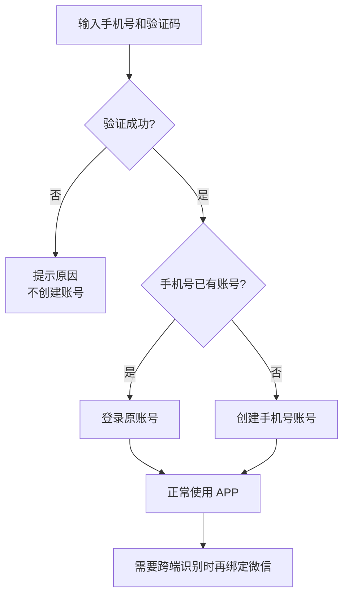

**关键规则：**

1. 手机号登录成功后可正常使用直播、收藏、分享、我的和购买，不在每个入口强制微信授权。
2. 只有需要关联微信身份或跨端同步时，才引导用户绑定微信。
3. 分享可调用系统分享；通讯录仅申请系统通讯录权限。

### 3.4 手机号用户后续绑定微信

**触发：** 手机号用户主动绑定微信，或确实需要跨端同步微信身份。

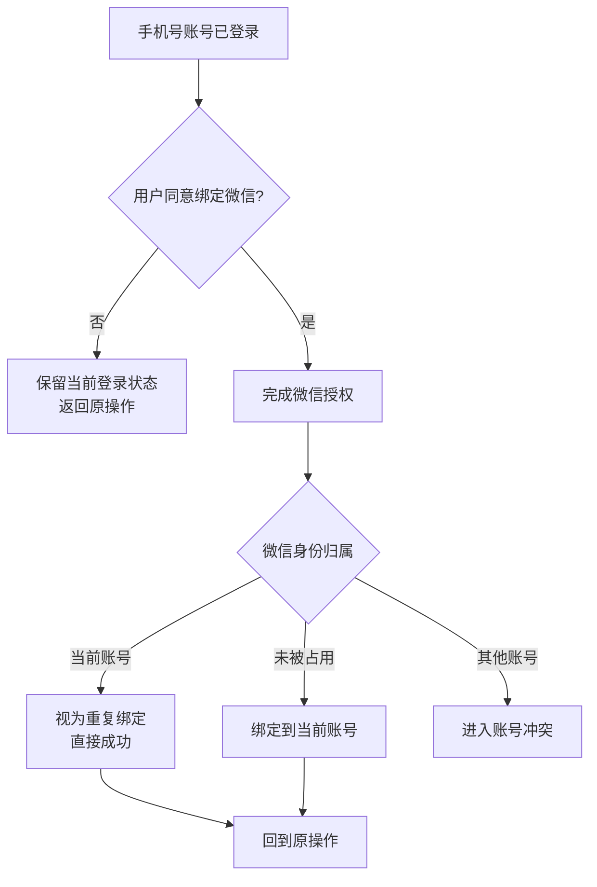

**关键规则：**

1. 用户拒绝或取消授权，不退出当前手机号账号。
2. 微信身份已属于其他账号时，不允许覆盖绑定。
3. 重复点击绑定必须得到相同结果，不能重复建号。

### 3.5 同 unionID、不同手机号

**触发：** unionID 已命中账号 A，但本次验证的手机号与 A 当前手机号不同。

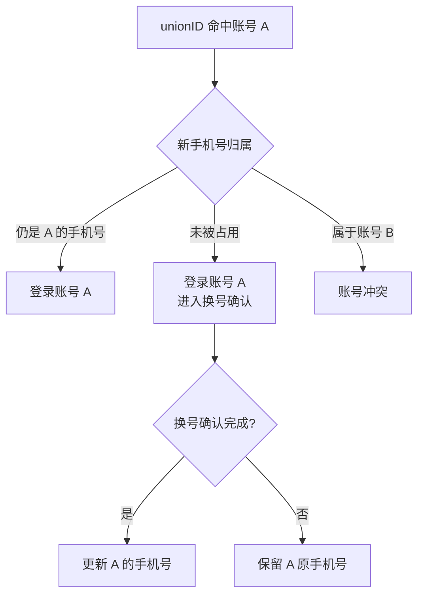

**关键规则：**

1. unionID 相同表示同一微信身份，不能因为手机号不同再创建微信账号。
2. 新手机号未被占用时，也要先完成换号确认，不能直接覆盖旧手机号。
3. 新手机号属于账号 B 时，停止处理并进入冲突。

### 3.6 同手机号、不同 unionID

**触发：** 手机号命中账号 A，但本次微信 unionID 与 A 已绑定的 unionID 不同。

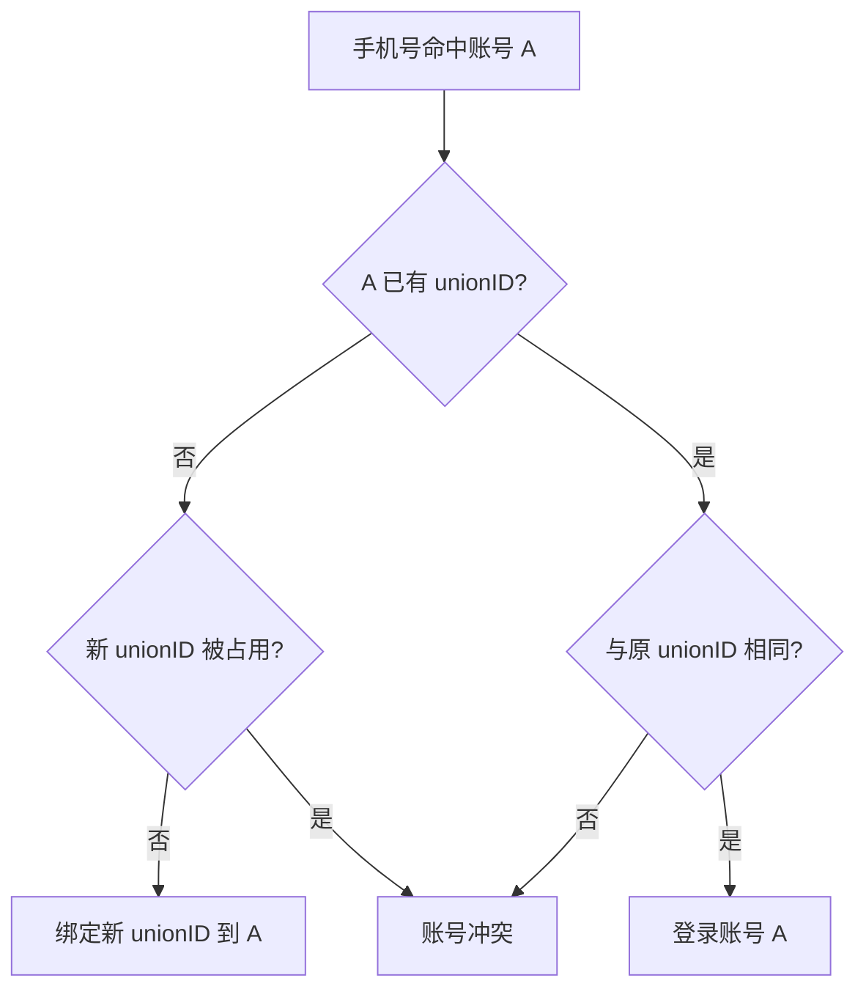

**关键规则：**

1. 账号 A 没有微信身份，且新 unionID 未被占用时，可以绑定。
2. 账号 A 已有不同 unionID 时，不覆盖原绑定，也不绑定第二个主 unionID。
3. 同一手机号可能被换号、共用或误用，不能仅凭手机号自动合并两个微信账号。

### 3.7 unionID 与 openID 命中不一致

**触发：** 本次同时取得 unionID 和当前 AppID + openID。

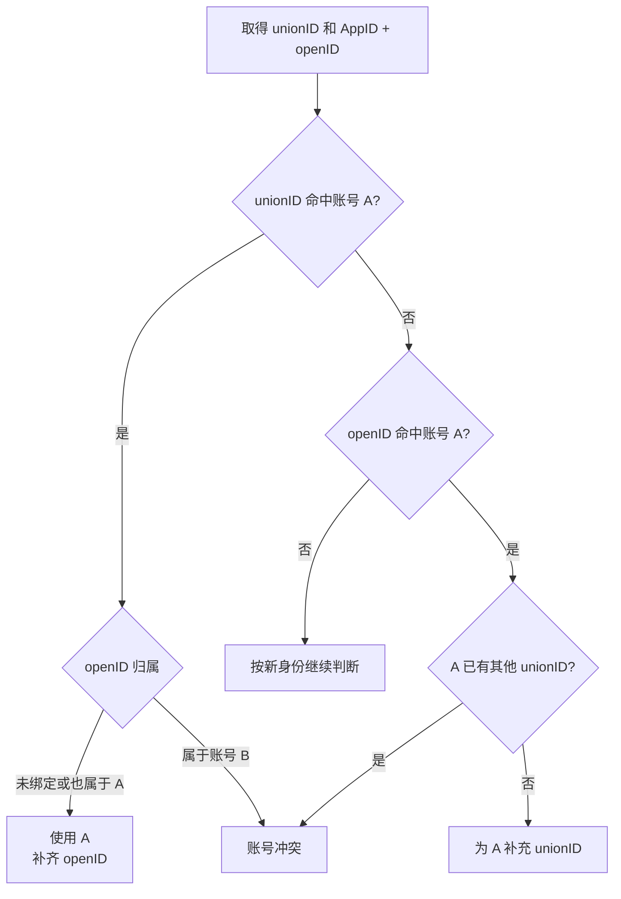

**关键规则：**

1. unionID 与 openID 命中同一账号时，直接登录并补齐缺失关系。
2. unionID 命中 A、openID 命中 B 时，必须进入冲突。
3. openID 命中 A，但 A 已有其他 unionID 时，不得覆盖。

### 3.8 不同 AppID、不同入口、不同租户

**触发：** 用户从新的 APP、小程序或租户入口登录。

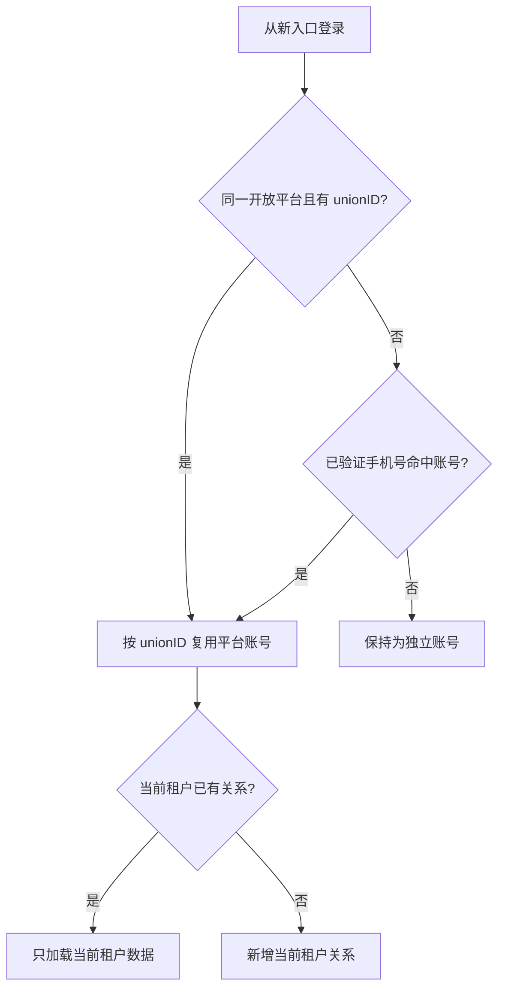

**关键规则：**

1. 不同 AppID 的 openID 不互相比较，即使字符串看起来相同也不能合并。
2. 同一微信开放平台下有 unionID 时，可跨 APP、小程序识别平台账号。
3. 平台账号可复用，但订单、会员、权益等仍按租户隔离。

### 3.9 首次没有 unionID，后续取得 unionID

**触发：** 账号 A 早期只记录了 AppID + openID，后续登录取得 unionID。

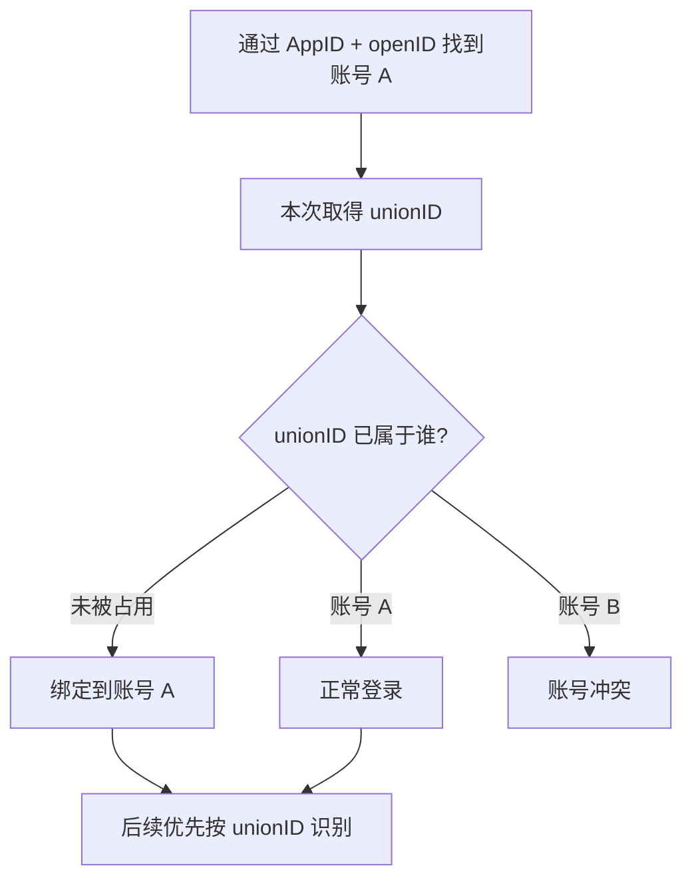

**关键规则：**

1. unionID 未被占用时，补充到原账号 A，不创建新账号。
2. unionID 已属于账号 B 时，不把 A 自动并入 B。
3. 补齐成功后，后续跨入口优先使用 unionID。

### 3.10 CASE 1：手机号 139 先登录，尚未绑定微信

**触发：** APP 已存在手机号账号 A（139），用户随后通过小程序微信登录。

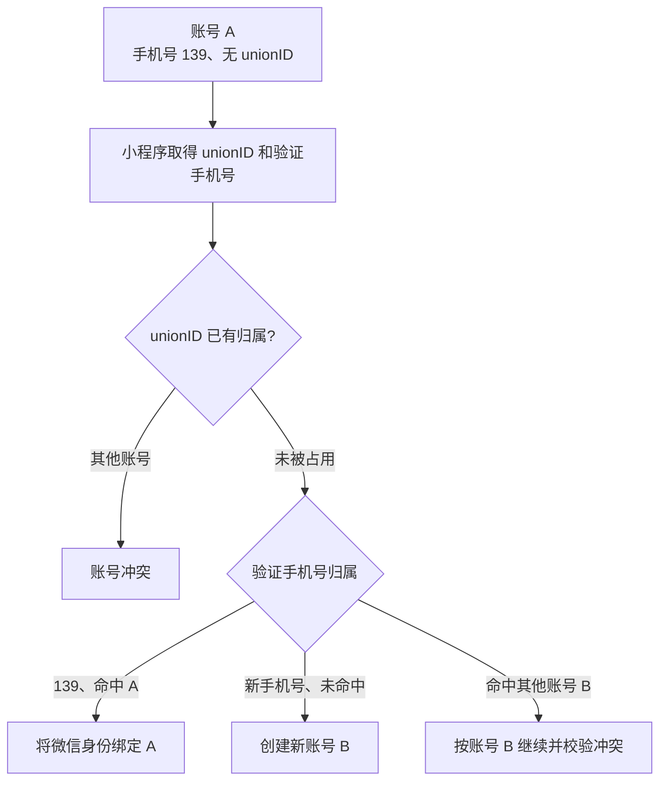

**最终结果：**

1. 小程序验证手机号为 139：合并为账号 A。
2. 小程序验证的是其他未使用手机号：创建新账号 B，不与 A 合并。
3. unionID 或手机号已属于其他账号：进入冲突。
4. 先小程序、后 APP 的顺序也必须得到相同结果。

### 3.11 CASE 2：微信账号已绑定手机号 138

**触发：** 账号 A 已绑定 unionID-1 和手机号 138，用户随后从小程序登录。

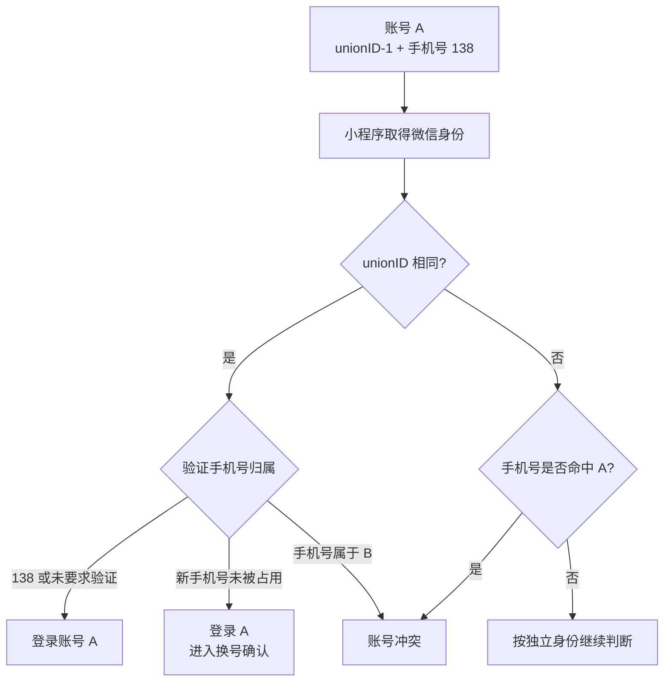

**最终结果：**

1. unionID 相同：仍是账号 A，手机号不同按“换号或冲突”处理。
2. unionID 不同但手机号仍是 138：冲突，不覆盖 A 的 unionID。
3. 登录顺序变化不能改变结果。

### 3.12 CASE 3：小程序先登录，且未要求手机号

**触发：** 租户开关关闭；小程序创建了账号 A，仅有 unionID-1。用户之后在 APP 用手机号创建账号 B，并尝试绑定微信。

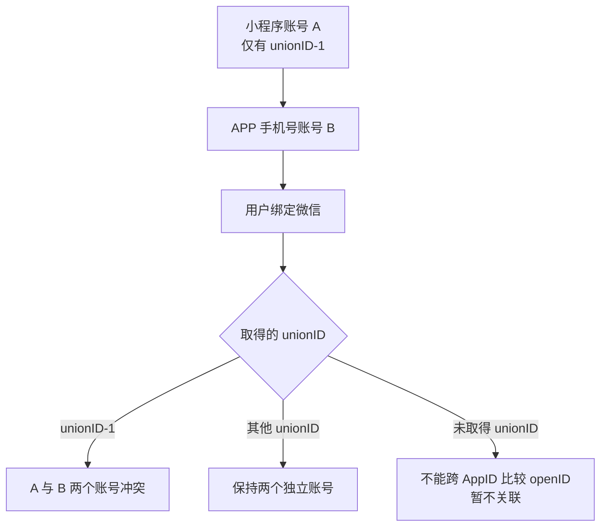

**最终结果：**

1. 取得 unionID-1 时，说明微信身份属于账号 A；不能自动覆盖或静默合并账号 B。
2. unionID 不同，保持不同账号。
3. 没有 unionID 时，不能通过 APP openID 与小程序 openID 判断是否同一人。

### 3.13 账号冲突处理

**触发：** 微信身份命中账号 A，但手机号或 openID 命中账号 B。

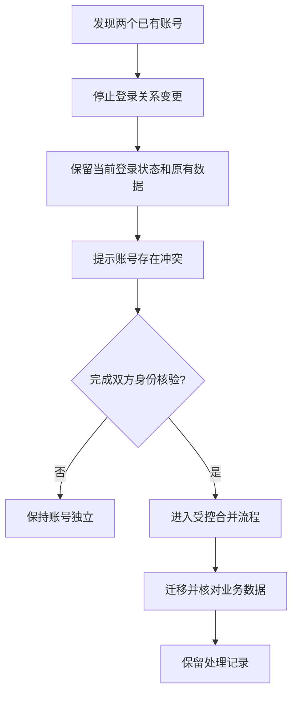

**关键规则：**

1. 发现冲突后，不创建第三个账号、不覆盖绑定、不静默切换账号。
2. 本期原型只展示冲突结果；真实账号合并和资产迁移不在本期实现。
3. 用户重复提交同一组冲突身份时，结果必须一致。

## 4. 异常和重复操作

| 场景 | 系统处理 | 用户最终状态 |
|---|---|---|
| 用户取消微信授权 | 不写入微信身份 | 保持原页面或原登录状态 |
| 用户拒绝手机号授权 | 开关关闭时可继续；开启且账号无手机号时不能完成微信登录 | 不创建半完成账号 |
| 微信授权失败或超时 | 提示重试或改用手机号登录 | 不新建、不绑定 |
| 验证码错误或过期 | 提示重新获取 | 不新建、不绑定 |
| 重复点击登录 | 复用同一次处理结果 | 不重复建号 |
| 重复绑定相同微信 | 返回已绑定成功 | 账号关系不变 |
| 同一身份并发登录 | 只保留一个最终账号结果 | 不产生重复账号 |
| 配置在登录过程中变化 | 本次按开始登录时的配置完成；下次使用新配置 | 避免流程中途反复跳转 |
| unionID 暂时未返回 | 当前 AppID 内可用 AppID + openID 识别 | 不跨 AppID 合并 |
| unionID 与手机号分属两账号 | 进入冲突 | 原账号和数据均保留 |
| 用户换绑手机号 | 先验证新号码并检查占用情况 | 未确认前保留原号码 |
| 手机号已被其他账号使用 | 进入冲突 | 不抢占、不覆盖 |
| 退出后重新登录 | 重新执行身份判断 | 结果应与上次一致 |
| 不同租户使用同一身份 | 复用平台身份，分别维护租户关系 | 只展示当前租户数据 |

## 5. 测试验收清单

| 编号 | 验收场景 | 预期结果 |
|---|---|---|
| T01 | 开关关闭，新用户微信登录 | 无需手机号，可完成登录 |
| T02 | 开关开启，新用户微信登录并验证新手机号 | 创建一个账号并同时绑定两种身份 |
| T03 | 开关开启，已有账号已有手机号 | 不重复要求手机号 |
| T04 | 开关开启，用户拒绝手机号 | 不完成微信登录，不产生半绑定 |
| T05 | unionID 命中 A、手机号未命中 | 使用 A，手机号可绑定 A |
| T06 | unionID 未命中、手机号命中 A | 使用 A，微信身份可绑定 A |
| T07 | unionID、手机号都命中 A | 直接登录 A |
| T08 | unionID 命中 A、手机号命中 B | 冲突，不自动合并 |
| T09 | 同 unionID，新手机号未被占用 | 使用原账号，进入换号确认 |
| T10 | 同 unionID，新手机号属于 B | 冲突，不覆盖手机号 |
| T11 | 手机号命中 A，A 无 unionID，新 unionID 未占用 | unionID 绑定 A |
| T12 | 手机号命中 A，A 已有其他 unionID | 冲突，不覆盖 unionID |
| T13 | unionID 命中 A、openID 命中 B | 冲突 |
| T14 | 首次无 unionID，按当前 AppID + openID 命中 A | 使用 A |
| T15 | 后续取得的 unionID 未被占用 | 补充到 A |
| T16 | 后续取得的 unionID 已属于 B | 冲突 |
| T17 | 不同 AppID 的 openID 字符串相同 | 不作为同一用户依据 |
| T18 | 手机号登录已有账号 | 登录原账号 |
| T19 | 手机号登录新用户 | 创建手机号账号 |
| T20 | 手机号用户取消绑定微信 | 保持当前登录和原操作状态 |
| T21 | 连续两次绑定同一微信 | 第二次直接返回已绑定，不重复写入 |
| T22 | 同一登录请求重复提交 | 只产生一个账号结果 |
| T23 | 同一用户进入两个租户 | 平台身份可识别，租户数据互相不可见 |
| T24 | 直播、收藏、分享、我的、购买入口 | 手机号用户可直接使用，不统一强制微信授权 |

## 6. 研发和测试统一验收口径

1. 相同身份组合，不受“先 APP、后小程序”或“先小程序、后 APP”影响。
2. 任何冲突都不得自动覆盖 unionID、openID 或手机号。
3. 跨 AppID 识别优先使用 unionID，不比较裸 openID。
4. 登录失败、用户拒绝、网络超时均不得产生半绑定账号。
5. 重复登录、重复授权、并发请求不得产生重复账号。
6. 账号处理结果必须能区分：登录原账号、新建账号、补充绑定、账号冲突。
7. 租户开关只改变是否要求手机号，不改变账号识别规则。
8. 不同租户的数据必须隔离，不能因为 unionID 相同而互相展示业务数据。

## 7. 评审前需确认

1. “不同项目”是否等同于“不同 AppID”；若不是，需要列出实际项目与 AppID 对应关系。
2. APP 和各小程序是否都绑定在同一微信开放平台。
3. 手机号换绑是否要求验证旧手机号，还是允许通过其他人工方式核验。
4. 账号冲突由用户自助处理，还是提交客服工单处理。
5. 账号合并时，订单、会员、课程、余额、积分、优惠券分别以哪个账号为主。
6. 开关是否按租户统一配置，是否还需要按 APP、小程序分别配置。
7. 现有历史用户中，缺少 unionID、手机号或存在重复绑定的数据量。
