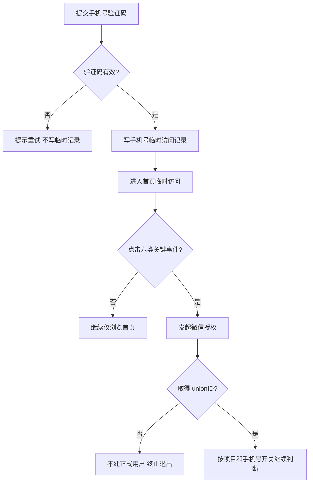

# APP / 小程序登录与账号合并规则

版本：V1.2（2026-09-25）
用途：研发、测试评审与拆用例
范围：当前租户下的当前项目账号；不实现真实微信接口和真实资产迁移。

## 1. 已确认的业务规则

1. 所有账号都是项目级账号，不存在全局账号。所有查找、绑定、候选和合并都限于当前 `tenant_id + project_id`。
2. 手机号验证码通过后只写临时访问记录，不创建正式用户。手机号临时访问用户只可查看首页。
3. 临时访问用户点击以下六类事件时必须微信授权：进入直播、下单、立即购买、收藏、分享、我的。通讯录不属于关键事件。
4. 正式用户以 unionID 识别。跨 APP / 小程序使用 unionID 的前提是客户端属于同一个微信开放平台。
5. openID 必须和 AppID 一起判断，只能识别同一个 AppID 下的既有身份；不同 AppID 的 openID 不得互相比对。
6. 配置「微信登录是否强制绑定手机号」只控制微信登录，不影响 APP 手机号验证码临时访问。
7. 手机号只有通过微信手机号授权或短信验证后，才能作为本人号码参与账号合并。收货地址、通讯录、邀请关系、手填号码只产生候选。
8. unionID 相同但已验证手机号不同：不覆盖、不重复建正式用户、不立即合并；等待手机号一致后重新判断。
9. unionID 与已验证手机号分别命中两个当前项目正式账号：不创建第三个账号；同号进入受控合并流程，异号保留两个账号。
10. 当前 APP 没有客服工单，也没有人工双账号核验、自助解绑功能。本需求不增加这些流程。
11. 本期只记录合并候选，不执行真实合并。两个账号、登录身份和资产保持原状，不展示“合并成功”。

## 2. 名词与账号边界

| 名称 | 业务含义 | 能否单独创建正式用户 |
|---|---|---|
| 手机号临时访问记录 | 手机号验证码通过后，记录手机号、端、项目、验证方式和时间 | 否 |
| 正式项目用户 | 当前项目内可进入完整业务的用户 | 取得 unionID 后，且通过当前开关要求 |
| unionID | 同一个微信开放平台下跨端识别微信身份 | 是，需限定当前项目 |
| AppID + openID | 一个具体 APP 或小程序入口中的微信身份 | 仅用于同 AppID 查找既有账号；无 unionID 且未命中时不新建 |
| 合并候选 | 号码碰撞或双账号判断后等待本人验证/业务规则的记录 | 否 |
| 已验证手机号 | 用户已通过微信手机号授权或短信验证的号码 | 可作为合并判断依据，但不能跨项目匹配 |

## 3. 登录入口流程

### 3.1 APP 手机号验证码登录

**触发：** 用户在 APP 选择手机号登录并提交验证码。

**处理规则：**

1. 验证码无效、过期或重复使用：提示重新获取，不写入临时记录。
2. 验证码成功：只写临时访问记录，user 表不创建正式用户，不建立正式登录态。
3. 临时访问期间只允许查看首页。进入直播、下单、立即购买、收藏、分享、我的时，必须发起微信授权。
4. 微信授权拒绝或失败：当前关键事件终止并退出，不创建正式用户；临时访问记录可保留审计。
5. 微信授权取得 unionID 后，按 4.1 的身份判断继续。满足手机号开关要求后，创建或进入正式账号并返回原操作。
6. 重复验证同一手机号时，可复用或更新当前项目中的有效临时访问记录，不创建多个正式用户。

### 3.2 APP 微信登录

**触发：** 用户在 APP 登录页选择微信登录。

1. 先完成微信授权，取得 unionID、AppID + openID；根据 unionID 在当前项目查询正式用户。
2. 开关关闭：unionID 命中则进入该用户；未命中则在当前项目创建正式用户。
3. 开关开启：
   - 已有用户已有有效的已验证手机号：不重复要求手机号，进入该用户。
   - 新用户：先完成微信手机号授权或短信验证，验证成功后才创建正式用户。
   - 已有用户缺手机号：要求完成手机号验证后才建立本次登录态；用户拒绝时不登录，但保留原账号及数据。
4. 验证手机号后重新判断 unionID 和手机号命中结果，按 4.1 处理。不得先创建新用户再等待手机号验证。
5. 微信授权失败：不新增用户或身份关系。

### 3.3 微信小程序登录

**触发：** 用户首次进入当前项目小程序，或登录状态失效后重新进入。

1. 微信授权取得 unionID 和当前小程序的 AppID + openID。
2. 开关关闭：按 unionID 在当前项目查找；命中则进入，未命中则创建当前项目用户。
3. 开关开启：新用户先验证手机号，再创建用户；已有用户按 APP 微信登录同样的规则处理。
4. 授权失败时不进入业务页；拒绝必要的手机号验证时不建立本次登录态。已有账号不得删除或改动。
5. 小程序不提供手机号验证码登录入口。此组合在矩阵中标记为“不适用”。

## 4. 身份判断与合并规则

### 4.1 取得 unionID 后的判断表

以下判断只查当前 `tenant_id + project_id`：

| unionID 命中 | 手机号状态 | 系统处理 | 结果 |
|---|---|---|---|
| 命中用户 A | 无需强制手机号，或 A 已有有效手机号 | 进入 A | 账号和资产不变 |
| 命中用户 A | 开关开启且 A 没有已验证手机号 | 先验证手机号 | 成功后再建立本次登录态；拒绝则退出但保留 A |
| 未命中 | 开关关闭 | 创建当前项目正式用户 | 绑定本次 unionID |
| 未命中 | 开关开启 | 先完成手机号验证，再创建用户 | 验证前不建正式用户、不建立登录态 |
| 命中 A | 已验证手机号未命中其他项目用户 | 按开关要求完成登录 | 号码可作为 A 的已验证手机号；不得覆盖 A 上已有的不同号码 |
| 命中 A | 已验证手机号命中 B，且 B 与 A 不同 | 不创建第三个用户；验证同号后记录候选 | 本期两个账号和资产保持原状 |
| 命中 A | 已验证手机号与 A 当前号码不同 | 不覆盖、不合并 | 等待后续验证到相同号码 |
| 未命中 | 已验证手机号命中 B | 不直接把新微信身份静默挂到 B；记录候选 | 不创建第三用户，不改变 B |

### 4.2 unionID / openID 的使用边界

1. unionID 仅在同一开放平台范围内作为跨端身份依据。APP 与小程序开放平台不一致时，unionID 不得直接用于跨端账号匹配。
2. 若本次没有 unionID，只允许用同一 AppID + openID 查找当前项目的既有身份关系。
3. 同 AppID + openID 已关联正式用户：可复用该用户，并继续检查开关要求。
4. 同 AppID + openID 未命中：不创建正式用户，不尝试拿其他 AppID 的 openID 或未验证手机号兜底；提示重试或结束本次登录。
5. 不同项目即使 unionID 相同，也各自创建/识别项目账号，不跨项目复用 user_id、合并账号或迁移资产。

### 4.3 同 unionID、不同手机号

1. **触发：** 已存在的 unionID 再次登录，但当前有效验证手机号与账号原号码不同。
2. **先判断：** 是否同租户同项目、unionID 是否来自同一个开放平台、手机号是否经过微信授权或短信验证。
3. **号码一致：** 进入原项目账号，不重复创建正式用户。
4. **号码不同：** 不修改原号码、不覆盖身份、不创建重复 unionID 用户；等待后续验证号码一致再判断。
5. 若历史数据中已有两个正式用户使用同一 unionID，记录数据冲突候选；本期保留两个账号及原资产。

### 4.4 两个账号命中与候选状态

1. 只有 unionID 与**已验证手机号**分别命中两个正式项目账号时，才构成双账号合并候选。收货地址、通讯录或手填手机号本身不是账号命中。
2. 候选范围不是必须的两个 `user_id`：另一侧可以是手机号临时访问记录。候选记录应能追溯触发入口、项目、候选手机号、本人验证结果和当前状态。
3. 确认同一号码且范围、账号状态均符合：记录待处理候选；不创建第三个账号。
4. 号码不同、本人未验证、用户拒绝、项目不同或账号状态异常：候选保持待确认/不合并；不覆盖任何绑定或资产。
5. 本期不执行真实合并：不迁移资产，不停用任何账号，不改动两边微信身份，不提示“合并完成”。
6. 重复触发同一身份组合：复用已有待处理候选或处理结果，不重复创建候选、不重复迁移。
7. 若验证页面可选择多个号码，用户每次选择都必须完成微信手机号授权或短信验证；按每个已验证号码重新匹配。仅勾选号码不算本人验证，匹配到当前项目账号后仍须遵守合并门槛。

## 5. 手机号碰撞触点（彼此独立）

### 5.1 未来新增场景：个人中心修改账号手机号（当前 APP 不存在）

1. 当前 APP 没有手机号换绑入口，因此本期不按现有功能实现或验收。
2. 只有产品确认新增该功能后，才触发“提交新账号手机号”流程。
3. 新功能需先由用户通过微信手机号授权或短信验证新号码，再查询当前项目是否被其他账号占用。
4. 新号未占用时可按新需求更新；已占用时生成候选，不覆盖对方号码、不先更新当前账号。
5. 验证失败/取消时不变更号码。新增功能的生效范围需另行确认。

### 5.2 首次下单：填写收货地址手机号

1. **触发：** 用户首次下单填写收货人手机号，发现该号码与当前项目某账号手机号相同。
2. **先判断：** 是否仅仅是收货号码碰撞。收货人可能不是下单人，因此只能生成待确认候选。
3. **订单流程：** 订单和收货地址按原规则继续提交；候选判断失败或用户拒绝验证，不得阻断下单。
4. **后续确认：** 只有本人通过微信手机号授权或短信验证后，才按验证号码重新执行 4.1 / 4.4。
5. 收货号码不得写成账号的已验证手机号。

### 5.3 通讯录：邀请或填写手机号

1. **触发：** 用户发起邀请或填写联系人手机号，号码碰撞到当前项目账号。
2. **先判断：** 号码可能属于被邀请人；邀请关系不证明当前登录用户与该账号是同一人。
3. **邀请流程：** 原邀请流程继续，同时记录待确认候选；通讯录不是六类强制微信授权事件。
4. **后续确认：** 本人通过微信手机号授权或短信验证后再执行账号匹配；拒绝或验证失败时不合并，不阻断邀请。

## 6. 8 种组合矩阵

组合轴：登录方式（微信 / 手机号验证码）× 端（APP / 小程序）× 开关（开 / 关）。M7、M8 为不适用，不是待开发的登录流程。

| 编号 | 登录方式 | 端 | 开关 | 结果规则 |
|---|---|---|---|---|
| M1 | 微信 | APP | 开 | 新用户先验证手机号，成功后按 unionID 建号；已有用户缺手机号时先验证，拒绝不登录但保留账号 |
| M2 | 微信 | APP | 关 | 按 unionID 登录/建当前项目用户，不强制手机号 |
| M3 | 微信 | 小程序 | 开 | 与 M1 相同的手机号要求；小程序没有手机号验证码登录 |
| M4 | 微信 | 小程序 | 关 | 按 unionID 登录/建当前项目用户，不强制手机号 |
| M5 | 手机号验证码 | APP | 开 | 验证成功只写临时记录；开关不影响手机号临时访问；六类事件再微信授权 |
| M6 | 手机号验证码 | APP | 关 | 同 M5；开关不影响该登录方式 |
| M7 | 手机号验证码 | 小程序 | 开 | 不适用：小程序无手机号验证码登录入口；验收入口不存在 |
| M8 | 手机号验证码 | 小程序 | 关 | 不适用：小程序无手机号验证码登录入口；验收入口不存在 |

## 7. 合并资产盘点（本期只盘点）

本期只盘点资产，不执行迁移。实际合并开发前，各类资产必须逐项写明去向、去重方式和对账方法。

| 用户身份 | 资产/关系清单 | 正式合并前需定义 |
|---|---|---|
| 买家 | 普通红包、现金红包、收藏、浏览足迹、订单、售后、积分、优惠券、会员权益、行为数据 | 余额/有效期/已用状态、订单归属、去重、历史行为保留、退款关联、失败恢复 |
| 店员 | 店员身份、所属店铺、佣金、佣金流水、操作记录 | 一个账号关联多店的处理、未结佣金、历史流水归属 |
| 店长 | 店长身份、所属店铺、佣金、店铺权限与操作记录 | 主店选择、权限生效时间、未结算数据 |
| 代理 | 代理身份、代理上下级关系、代理范围、佣金与结算记录 | 层级关系冲突、有效范围、未结算佣金、历史归属 |

**合并执行门槛：** 主账号选择、每类资产规则、unionID 身份保留、失败回滚/恢复方式均确认前，原账号和资产保持不变，只保存候选与验证记录。

## 8. 关键异常和重复操作

| 场景 | 系统处理 | 用户/数据结果 |
|---|---|---|
| 验证码错误、过期、重复使用 | 提示重新获取，不写临时记录 | 无新增记录、无正式用户 |
| 拒绝微信授权 | 结束本次流程 | 不新建用户；已有账号不变 |
| 开关开启时拒绝必要的手机号验证 | 结束本次登录 | 新用户不创建；已有用户保留，但本次无登录态 |
| unionID 缺失且同 AppID + openID 未命中 | 提示重试 | 不创建正式用户 |
| unionID 缺失但同入口身份已命中 | 使用既有项目用户，并执行手机号开关检查 | 不跨端、不跨项目查找 |
| 业务号码碰撞但没有本人验证 | 保存待确认候选 | 不绑定、不合并；订单/邀请照常按原流程 |
| 微信手机号授权或短信验证失败 | 提示重试或取消 | 不更新账号手机号、不合并 |
| 已验证号码与已有账号号码不同 | 记录等待原因 | 账号、绑定和资产不变 |
| 两个账号属于不同项目 | 不进行匹配或合并 | 两边账号和资产独立 |
| 项目账号被停用/注销或状态异常 | 不允许借新身份绕过状态 | 不登录、不合并；保留原数据（账号状态校验按现有规则） |
| 并发创建/重复点击/重复授权 | 同一身份与请求只产生一个结果 | 不重复建号或处理 |
| 候选重复触发 | 复用同一待处理候选 | 不生成多个相同候选 |
| 合并策略未定、处理中断或失败 | 暂停执行并记录原因 | 原账号、身份和资产不变；不显示完成 |
| 配置在登录流程中途变化 | 本次按进入流程时读取的配置完成判断；下一次流程读取新配置 | 不在单次流程中途切换规则 |
| 开关由关改为开 | 新登录执行强制手机号规则 | 本期不扫描历史业务号码，也不批量合并；已有候选保持原状态 |

## 9. 测试验收清单

| ID | 场景 | 验收结果 |
|---|---|---|
| T01 | APP 手机号验证码正确 | 只产生临时记录，正式用户数不变，只能查看首页 |
| T02 | APP 手机号验证码错误/过期 | 不产生临时记录和正式用户 |
| T03 | 六类关键事件逐个触发授权 | 进入微信授权；成功返回原事件 |
| T04 | 通讯录操作 | 不作为强制微信授权事件 |
| T05 | 关键事件拒绝微信授权 | 退出，不创建新用户；保留临时记录审计 |
| T06 | APP 微信登录，开关关，unionID 未命中 | 创建一个当前项目正式用户，无需手机号 |
| T07 | APP 微信登录，开关开，新用户拒绝手机号验证 | user 不新增，不建立登录态 |
| T08 | APP 微信登录，开关开，已有账号无手机号并拒绝验证 | 本次不登录，已有账号及数据不变 |
| T09 | 开关开，已有用户已有有效手机号 | 不重复要求手机号 |
| T10 | 小程序开关开/关登录 | 分别按 M3/M4 规则处理 |
| T11 | 小程序手机号登录入口 | 开关开、关都不存在入口（M7/M8） |
| T12 | 手机号登录 APP 切换开关 | M5/M6 主流程完全相同，开关不额外强制授权 |
| T13 | 同一开放平台、unionID 命中已有项目用户 | 进入原用户，不创建新用户 |
| T14 | 不同项目 unionID 相同 | 两个项目各自账号，不跨项目合并或共享资产 |
| T15 | APP 与小程序 openID 字符串相同但 AppID 不同 | 不作为同一身份依据 |
| T16 | unionID 缺失，同 AppID + openID 命中当前项目账号 | 只复用该已有账号，再执行手机号开关规则 |
| T17 | unionID 缺失，同入口 openID 未命中 | 不创建正式用户，提示重试 |
| T18 | unionID 相同、已验证手机号由 139 变为 138 | 不覆盖、不新建重复用户、不合并；等待号码一致 |
| T19 | unionID 命中 A，已验证手机号命中 B，号码相同 | 只创建/复用候选，不新建第三个账号；两边账号与资产不变 |
| T20 | unionID 命中 A，收货地址手机号碰撞 B，但未本人验证 | 只记录候选；订单与收货地址流程可继续 |
| T21 | 首次下单收货地址号码无碰撞/有碰撞 | 无碰撞正常保存；有碰撞也不阻断订单，仅增加候选 |
| T22 | 通讯录号码命中账号手机号 | 邀请流程继续，只有本人授权或短信验证后才重新匹配 |
| T23 | 当前 APP 个人中心手机号换绑 | 确认当前版本没有该入口，本期不得新增换绑流程 |
| T24 | 手机号授权/短信选择列表多次操作 | 每个号码都须完成本人验证后分别匹配；仅勾选号码不能合并 |
| T25 | 同一候选重复提交或并发触发 | 返回同一个处理结果，不重复建候选/迁移 |
| T26 | 候选创建失败或重复提交 | 失败提示重试，重复提交返回原候选；账号、身份与资产不变 |
| T27 | 开关关闭后已存在的收货/通讯录号码 | 开关改开不静默批量合并或绑定 |
| T28 | 资产清单 | 覆盖买家、店员、店长、代理及本文件列出的全部资产/关系 |

## 10. 本期边界

**本期不做：** 真实微信 OAuth、手机号接口、真实数据库迁移；客服工单；人工双账号核验；自助解绑；真实账号/订单/红包/积分/会员/佣金迁移。

**实际开发账号合并前，必须补齐以下规则：**

1. 哪个账号作为合并后的主账号，以及选择依据。
2. 买家、店员、店长、代理各类资产逐项采用迁移、保留、去重、冻结、结算或其他处理。
3. 多个 unionID 合并后如何保留微信登录身份。
4. 合并失败时哪些步骤回滚，怎样恢复和对账。
5. 同一项目的微信开放平台/AppID 对应关系，以及历史缺少 unionID、手机号重复等数据清理规则。

本期支持临时访问、授权、unionID 识别和候选生成。真实账号及资产合并不在本期执行范围。
